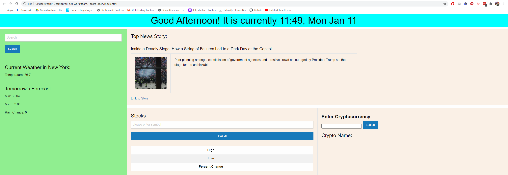

# team7-score-dash

User Story:

===========


<br>

## Local Storage

```js
setInterval(dateAndTime, 1000);

getWeather(
  localStorage.getItem("lastCity"),
  localStorage.getItem("lastCountry")
);
```

<br>

## API 1

```js
function getStock(ticker='TSLA'){
    var url = 'https://www.alphavantage.co/query?function=GLOBAL_QUOTE&symbol='+ticker+'&apikey=AM5YIH12ODHXL7UF';
    $.ajax({
        url: url,
        method: 'GET',
    }).then(function (response) {
        console.log(response)
        var stock, price, high, low, perChange;
        var globalQuote = response['Global Quote']
        console.table(globalQuote);
```

<br>

## API 2

```js
$.ajax({
  url: cryptoURL,
  method: "GET",
  cors: true,
  beforeSend: function () {
    $("#loaderCirc").attr("style", "display: flex");
  },
  complete: function () {
    $("#loaderCirc").attr("style", "display: none");
  },
});
```

<br>

## Live Weather

```js
$.ajax({
        url: currWURL,
        method: "GET",
    }).then(function (response) {
        console.log(response);

        let temp = Math.round(response.main.temp);
        currTemp.text("Temperature: " + temp + "\xB0 F");
        var weatherIcon = response.weather[0].icon;
        currTemp.append("</img>");

        latInp = response.coord.lat;
        lngInp = response.coord.lon;
        initMap(city);
    }

```

<br>

## New third party API

```js
function initMap() {
    coords = {lat: latInp, lng: lngInp};
    map = new google.maps.Map(document.getElementById("map"), {
      center: coords,
      zoom: 8,
    });
```

## Deployed Link

- [See Live Site](/)

## Built With

- [HTML](https://developer.mozilla.org/en-US/docs/Web/HTML)
- [CSS](https://developer.mozilla.org/en-US/docs/Web/CSS)
- [Javascript](https://developer.mozilla.org/en-US/docs/Web/JavaScript)
- [Bootstrap](https://getbootstrap.com/)
- [CoinMarketCap](https://coinmarketcap.com/api/)
- [OpenWeatherMap](https://openweathermap.org/api)
- [News API(TBD)]()
- [Stocks API](https://www.alphavantage.co/)

## Authors

**Jasmine Franklin** [LinkedIn](https://www.linkedin.com/in/jasmine-franklin-8b08ba121)

**Shaun Limbeek**

**Sammy Kroner** [LinkedIn](www.linkedin.com/in/samuel-kroner-44aa11169)

## License

This project is licensed under the MIT License

See also the list of [contributors](https://github.com/your/project/contributors) who participated in this project.

<p>&copy; UC Berkeley Extension Bootcamp.</p>
